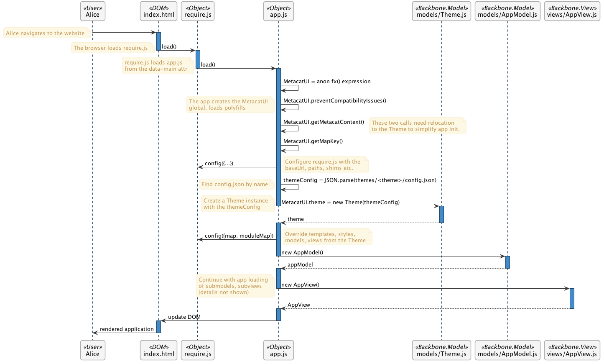

MetacatUI Application Architecture
=====================================

Overview
--------

Directory layout
----------------

Module structure
----------------

Application flow
----------------

The following sequence diagram illustrates the top level flow of the application at initialization time.

..
    @startuml images/architecture.png
    !include ../plantuml-styles.txt

    participant Alice <<User>>
    participant index.html <<DOM>>
    participant require.js <<Object>>
    participant app.js <<Object>>
    participant "models/Theme.js" <<Backbone.Model>>
    participant "models/AppModel.js" <<Backbone.Model>>
    participant "views/AppView.js" <<Backbone.View>>
    
    Alice -> index.html
    note left
        Alice navigates to the website
    end note
    activate index.html
    index.html -> require.js : load()
    deactivate index.html
    activate require.js
    note left
        The browser loads require.js
    end note
    require.js -> app.js: load()
    deactivate require.js
    note left
        require.js loads app.js
        from the data-main attr
    end note
    activate app.js
    app.js -> app.js : MetacatUI = anon fx() expression
    app.js -> app.js : MetacatUI.preventCompatibilityIssues()
    note left
        The app creates the MetacatUI
        global, loads polyfills
    end note
    app.js -> app.js : MetacatUI.getMetacatContext()
    note right
        These two calls need relocation
        to the Theme to simplify app init.
    end note
    app.js -> app.js : MetacatUI.getMapKey()
    app.js -> require.js: config({...})
    note right
        Configure require.js with the 
        baseUrl, paths, shims etc.
    end note
    app.js -> app.js : themeConfig = JSON.parse(themes/<theme>/config.json)
    note left
        Find config.json by name
    end note
    app.js -> "models/Theme.js": MetacatUI.theme = new Theme(themeConfig)
    note left
        Create a Theme instance
        with the themeConfig
    end note
    deactivate app.js
    activate "models/Theme.js"
    "models/Theme.js" --> app.js : theme
    deactivate "models/Theme.js"
    activate app.js
    app.js -> require.js: config({map: moduleMap})
    note right
        Override templates, styles,
        models, views from the Theme
    end note
    app.js -> "models/AppModel.js" : new AppModel()
    deactivate app.js
    activate "models/AppModel.js"
    "models/AppModel.js" --> app.js : appModel
    deactivate "models/AppModel.js"
    activate app.js
    app.js -> "views/AppView.js" : new AppView()
    deactivate app.js
    note left
        Continue with app loading
        of submodels, subviews
        (details not shown)
    end note
    activate "views/AppView.js"
    "views/AppView.js" --> app.js : AppView
    deactivate "views/AppView.js"
    activate app.js
    app.js -> index.html : update DOM
    deactivate app.js
    activate index.html
    index.html -> Alice : rendered application
    deactivate index.html
    @enduml

#. The user navigates to ``index.html``

#. The ``require.js`` module is loaded from a single ``<script>`` element in the ``index.html`` document.

#. ``require.js`` reads the ``data-main`` attribute of the ``script`` element, and loads ``app.js``

    .. note::
        We previously used a ``loader.js`` script and configured ``require.js`` based on the theme name. This is all handled directly in ``app.js`` now.

#. Upon loading ``app.js``, the global ``MetacatUI`` object is instantiated using the standard module pattern with an anonymous function expression.

#. Once instantiated, ``MetacatUI.preventCompatibilityIssues()`` is called to apply polyfills for older browsers.

#. ``MetacatUI.getMetacatContext()`` and ``MetacatUI.getMapKey()`` are called.

    .. note::
        These two calls should be relocated into the theming configuration.  We still have a ``data-map-key`` and a ``data-metacat-context`` attribute in the ``index.html`` ``<script>>`` tag.  These properties vary by theme, and so should be loaded by the theme.
#. Configure RequireJS with the baseUrl of ``js/``, a ``path`` object with all of the dependency locations on disk, and a ``shim`` object providing export information for non-AMD-compliant modules.

#. With the theme name available, build a path to the theme's ``config.json`` file, and parse the configuration. Pass this object as the attributes object when creating an instance of the ``Theme`` Backbone model.

#. Set ``MetacatUI.theme`` to be the newly created ``Theme`` instance that is used by the rest of the application.

#. With the theme available, update the RequireJS configuration with a ``map`` attribute, and set it's value to the theme's ``moduleMap``.  This provides overrides of all templates, CSS, and JS modules so the theme can customize the application.

#. Application loading continues in ``app.js`` by creating a new ``AppModel`` instance and an ``AppView`` instance.  Sub-models and sub-views are also created at this point (details omitted here.)

#. As the ``AppView`` and its sub-views are rendered, the DOM is updated and the fully rendered application is presented in the browser. 

