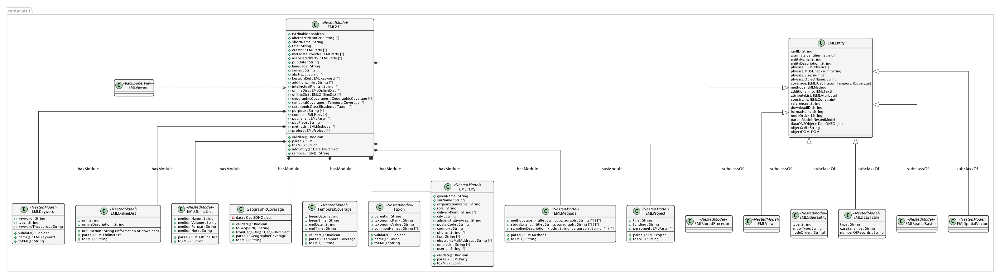

..
   @startuml images/editor-design-eml-package.png  

     !include plantuml-styles.txt

     ' override the linetype
     skinparam linetype ortho   
  

     package metacatui {
       class EML211 <<NestedModel>> {
         + isEditable : Boolean
         + alternateIdentifier : String [*]
         + shortName : String
         + title : String
         + creator : EMLParty [*]
         + metadataProvider : EMLParty [*]
         + associatedParty  : EMLParty [*]
         + pubDate : String
         + language : String
         + series : String
         + abstract : String [*]
         + keywordSet : EMLKeyword [*]
         + additionalInfo : String [*]
         + intellectualRights : String [*]
         + onlineDist : EMLOnlineDist [*]
         + offlineDist : EMLOfflineDist [*]
         + geographicCoverages : GeographicCoverage [*]
         + temporalCoverages : TemporalCoverage [*]
         + taxonomicClassifications : Taxon [*]
         + purpose : String [*]
         + contact : EMLParty [*]
         + publisher : EMLParty [*]
         + pubPlace : String
         + methods : EMLMethods [*]
         + project : EMLProject [*]
         + validate() : Boolean
         + parse()  : EML
         + toXML() : String
         + addEntity() : DataONEObject
         + removeEntity() : String
       }
       
       class EMLViewer <<Backbone.View>> {
       }
       
       class EMLKeyword <<NestedModel>> {
         + keyword : String
         + type : String
         + keywordThesaurus : String
         + validate() : Boolean
         + parse()  : EMLKeyword
         + toXML() : String
       }
       
       class EMLOnlineDist <<NestedModel>> {
         + url : String
         + urlFunction : String (information or download)
         + onlineDescription : String
         + parse() : EMLOnlineDist
         + toXML() : String
       }
       
       class EMLOfflineDist <<NestedModel>> {
         + mediumName : String
         + mediumVolume : String
         + mediumFormat : String
         + mediumNote : String
         + parse() : EMLOfflineDist
         + toXML() : String
       }
              
       class GeographicCoverage {
         - data : GeoJSONObject
         + validate() : Boolean
         + toGeoJSON() : String
         + fromGeoJSON() : GeoJSONObject
         + parse() : GeographicCoverage
         + toXML() : String
       }
       
       class TemporalCoverage <<NestedModel>> {
         + beginDate : String
         + beginTime : String
         + endDate : String
         + endTime : String
         + validate() : Boolean
         + parse() : TemporalCoverage
         + toXML() : String
       }
       
       class Taxon <<NestedModel>> {
         + parentId : String
         + taxonomicRank : String
         + taxonomicValue : String
         + commonNames : String [*]
         + validate() : Boolean
         + parse() : Taxon
         + toXML() : String
       }
        
       class EMLParty <<NestedModel>> {
         + givenName : String
         + surName : String
         + organizationName : String
         + role : String
         + deliveryPoint : String [*]
         + city : String
         + administrativeArea : String
         + postalCode : String
         + country : String
         + phone : String [*]
         + fax : String [*]
         + electronicMailAddress : String [*]
         + onlineUrl : String [*]
         + userId : String [*]
         + validate() : Boolean
         + parse()  : EMLParty
         + toXML() : String
       }
       
       class EMLMethods <<NestedModel>> {
       	 + methodSteps : { title : String, paragraph : String [*] } [*]
       	 + studyExtent : { title : String, paragraph : String [*] } [*]
       	 + samplingDescription : { title : String, paragraph : String [*] } [*]
         + parse() : EMLMethods
         + toXML() : String
       }
       
       class EMLProject <<NestedModel>> {
         + title : String
         + funding : String 
         + personnel : EMLParty [*]
         + parse() : EMLProject
         + toXML() : String
       }
       
       class EMLEntity {
           xmlID: String
           alternateIdentifier: [String]
           entityName: String
           entityDescription: String
           physical: [EMLPhysical]
           physicalMD5Checksum: String
           physicalSize: number
           physicalObjectName: String
           coverage: [EML{Geo|Taxon|Temporal}Coverage]
           methods: EMLMethod
           additionalInfo: [EMLText]
           attributeList: [EMLAttribute]
           constraint: [EMLConstraint]
           references: String
           downloadID: String
           formatName: String
           nodeOrder: [String]
           parentModel: NestedModel
           dataONEObject: DataONEObject
           objectXML: String
           objectDOM: DOM
       }
       
       class EMLDataTable <<NestedModel>> {
           type : String
           caseSensitive : String
           numberOfRecords : String
       }
       
       class EMLSpatialRaster <<NestedModel>> {
       }
       
       class EMLSpatialVector <<NestedModel>> {
       }
       
       class EMLStoredProcedure <<NestedModel>> {
       }
       
       class EMLView <<NestedModel>> {
       }
       
       class EMLOtherEntity <<NestedModel>> {
            type: String
            entityType: String
            nodeOrder: [String]
       }
     }
     
     EML211 *-- EMLParty : "hasModule"
     EML211 *-- EMLMethods : hasModule
     EML211 *-- EMLProject : hasModule
     EML211 *-- GeographicCoverage : "hasModule"
     EML211 *-- TemporalCoverage : "hasModule"
     EML211 *-- Taxon : "hasModule"
     EML211 *-- EMLOnlineDist : hasModule
     EML211 *-- EMLOfflineDist : hasModule
     EML211 *-- EMLKeyword : hasModule
     EML211 *-right- EMLEntity : hasModule
     EMLEntity <|-down- EMLDataTable : subclassOf
     EMLEntity <|-down- EMLSpatialRaster : subclassOf
     EMLEntity <|-down- EMLSpatialVector : subclassOf
     EMLEntity <|-down- EMLStoredProcedure : subclassOf
     EMLEntity <|-down- EMLView : subclassOf
     EMLEntity <|-down- EMLOtherEntity : subclassOf
     EML211 <.right. EMLViewer : listensTo
     
   @enduml

