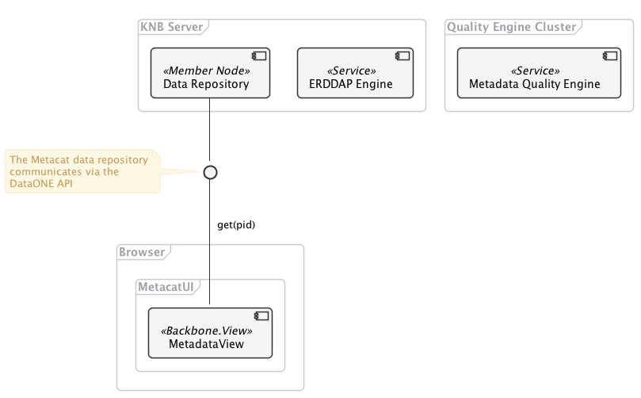

ERDDAP Integration Architecture
===============================

This document provides an overview architecture for incorporating ERDDAP data processing support into the MetacatUI web application. The goal is to support a number of use cases where a scientist needs to explore, visualize, and filter data that are large or complex before downloading all or subsets of the data locally.

.. TODO: Describe the architecture of how the components interact

Component Diagram
-----------------
..
  @startuml images/erddap-integration-architecture.png

    !include ../plantuml-styles.txt
    
    ' For component diagram help see http://plantuml.com/component-diagram
    ' Define the components

    frame "Quality Engine Cluster" {
        [Metadata Quality Engine] <<Service>>
    }
    
    frame "KNB Server" {
        [ERDDAP Engine] <<Service>>
        [Data Repository] <<Member Node>>
    }
    
    frame Browser{
        frame MetacatUI {
            [MetadataView] <<Backbone.View>>
        }
    }

    interface d1api as " "
    
    ' Define the interactions
    [Data Repository] -down- d1api
    
    note left of d1api
        The Metacat data repository
        communicates via the 
        DataONE API
    end note
    
    [MetadataView] -up- d1api: "  get(pid)"
    
    ' TODO: Define the interactions between the 
    ' MetacatUI components and ERDDAP,
    ' and the MDQ Engine via their respective APIs
    
    ' TODO: Define the sub views of the MetadataView
    ' that will encapsulate the ERDDAP client functionality
    
    ' TODO: Determine how/when the MDQ engine will be
    ' called or used. We may want to add a "Data Team" actor
    ' to do manual quality runs, or decide if it will be automated
    
  @enduml

Sequence Diagrams
-----------------

.. TODO: Add sequence diagrams to show the ERDDAP use cases
